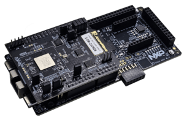
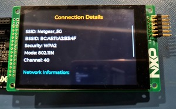

# NXP Application Code Hub

## Wi-Fi connect using LCD interface on FRDM-MCXN947 using Wi-Fi expansion board FRDM-IW416-AW-AM510
This is a demo example of Wi-Fi connect using LCD interface on FRDM-MCXN947 using Wi-Fi expansion board FRDM-IW416-AW-AM510.

#### Boards: FRDM-MCXN947
#### Expansion Boards: FRDM-IW416-AW-AM510
#### Categories: Graphics, RTOS, Wireless Connectivity
#### Peripherals: UART, SDIO, DISPLAY
#### Toolchains: MCUXpresso IDE

## Table of Contents
1. [Software](#step1)
2. [Hardware](#step2)
3. [Setup](#step3)
4. [FAQs](#step5) 
5. [Support](#step6)
6. [Release Notes](#step7)

## 1. Software
- [MCUXpresso 11.9.0 or newer.](https://nxp.com/mcuxpresso)
- [MCUXpresso for VScode 1.5.61 or newer](https://www.nxp.com/products/processors-and-microcontrollers/arm-microcontrollers/general-purpose-mcus/lpc800-arm-cortex-m0-plus-/mcuxpresso-for-visual-studio-code:MCUXPRESSO-VSC?cid=wechat_iot_303216)
- [SDK for FRDM-MCXN947.](https://mcuxpresso.nxp.com/en/select)

## 2. Hardware
- [FRDM MCXN947](https://www.nxp.com/design/design-center/development-boards-and-designs/general-purpose-mcus/frdm-development-board-for-mcx-n94-n54-mcus:FRDM-MCXN947)   

- [FRDM-IW416-AW-AM510](https://www.azurewave.com/wireless-modules-nxp.html)   

- [LCD-PAR-S035.](https://www.nxp.com/design/design-center/development-boards/3-5-480x320-ips-tft-lcd-module:LCD-PAR-S035)    

## 3. Setup

### 3.1 Step 1
1. Open MCUXpresso IDE, in the Quick Start Panel, choose Import from Application Code Hub   

2. Enter the demo name in the search bar.

3. Click Copy GitHub link, MCUXpresso IDE will automatically retrieve project attributes, then click Next>.

4. Select main branch and then click Next>, Select the MCUXpresso project, click Finish button to complete import.

### 3.2 Prepare demo
1.  Connect a USB type C cable between the PC host and the CMSIS DAP USB port on the FRDM-MCXN947 board

2.  Open a serial terminal with the following settings:
    - 115200 baud rate
    - 8 data bits
    - No parity
    - One stop bit
    - No flow control
3.  Set jumpers of Wi-Fi expansion board FRDM-IW416-AW-AM510.

    - Remove J12, J3 (All 4)
    - Add J7 2-3

4.  Connect the Wi-Fi expansion board FRDM-IW416-AW-AM510 to the FRDM-MCXN947.

5.  For the LCD Connection, first check the SW1 on the LCD back side, the position of the switch should be 010. Plugin the LCD-PAR-S035 module on J8 Connector. LCD-PAR-S035 has two extra rows that will not match with the J8 of the FRDM-MCXN947 board so make sure it is connected properly as the reference picture below.

6.  Download the program to the target board.
7.  Either press the reset button on your board or launch the debugger in your IDE to begin running the demo.

### 3.4 Run Demo
1.  LCD start up screen

2.  Press scan button to get list of available nearby Wi-Fi networks

3.  Click to connect to any of the network shown in the scan list

4.  Enter password to connect to the selected Network

5.  Click on the connect button after entering the password

6.  Wait for the successful connection

7.  After successful connection check the network details by scrolling on LCD

## 5. FAQs
*Include FAQs here if appropriate. If there are none, then remove this section.*

## 6. Support
*Provide URLs for help here.*

#### Project Metadata

<!----- Boards ----->

<!----- Categories ----->

<!----- Peripherals ----->

<!----- Toolchains ----->

Questions regarding the content/correctness of this example can be entered as Issues within this GitHub repository.

>**Warning**: For more general technical questions regarding NXP Microcontrollers and the difference in expected functionality, enter your questions on the [NXP Community Forum](https://community.nxp.com/)

## 7. Release Notes
| Version | Description / Update                           | Date                        |
|:-------:|------------------------------------------------|----------------------------:|
| 1.0     | Initial release on Application Code Hub        | November 29th 2024 |

<small> <b>Trademarks and Service Marks</b>: There are a number of proprietary logos, service marks, trademarks, slogans and product designations ("Marks") found on this Site. By making the Marks available on this Site, NXP is not granting you a license to use them in any fashion. Access to this Site does not confer upon you any license to the Marks under any of NXP or any third party's intellectual property rights. While NXP encourages others to link to our URL, no NXP trademark or service mark may be used as a hyperlink without NXP’s prior written permission. The following Marks are the property of NXP. This list is not comprehensive; the absence of a Mark from the list does not constitute a waiver of intellectual property rights established by NXP in a Mark. </small>   <small> NXP, the NXP logo, NXP SECURE CONNECTIONS FOR A SMARTER WORLD, Airfast, Altivec, ByLink, CodeWarrior, ColdFire, ColdFire+, CoolFlux, CoolFlux DSP, DESFire, EdgeLock, EdgeScale, EdgeVerse, elQ, Embrace, Freescale, GreenChip, HITAG, ICODE and I-CODE, Immersiv3D, I2C-bus logo , JCOP, Kinetis, Layerscape, MagniV, Mantis, MCCI, MIFARE, MIFARE Classic, MIFARE FleX, MIFARE4Mobile, MIFARE Plus, MIFARE Ultralight, MiGLO, MOBILEGT, NTAG, PEG, Plus X, POR, PowerQUICC, Processor Expert, QorIQ, QorIQ Qonverge, RoadLink wordmark and logo, SafeAssure, SafeAssure logo , SmartLX, SmartMX, StarCore, Symphony, Tower, TriMedia, Trimension, UCODE, VortiQa, Vybrid are trademarks of NXP B.V. All other product or service names are the property of their respective owners. © 2021 NXP B.V. </small>

<small> NXP, the NXP logo, NXP SECURE CONNECTIONS FOR A SMARTER WORLD, Airfast, Altivec, ByLink, CodeWarrior, ColdFire, ColdFire+, CoolFlux, CoolFlux DSP, DESFire, EdgeLock, EdgeScale, EdgeVerse, elQ, Embrace, Freescale, GreenChip, HITAG, ICODE and I-CODE, Immersiv3D, I2C-bus logo , JCOP, Kinetis, Layerscape, MagniV, Mantis, MCCI, MIFARE, MIFARE Classic, MIFARE FleX, MIFARE4Mobile, MIFARE Plus, MIFARE Ultralight, MiGLO, MOBILEGT, NTAG, PEG, Plus X, POR, PowerQUICC, Processor Expert, QorIQ, QorIQ Qonverge, RoadLink wordmark and logo, SafeAssure, SafeAssure logo , SmartLX, SmartMX, StarCore, Symphony, Tower, TriMedia, Trimension, UCODE, VortiQa, Vybrid are trademarks of NXP B.V. All other product or service names are the property of their respective owners. © 2021 NXP B.V. </small>
